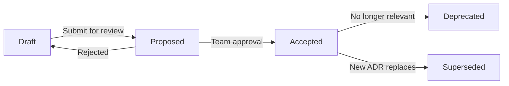

# Architecture Decision Records (ADRs)

This directory contains records of architectural decisions made in the K12 MyPortal project.

## What is an ADR?

An Architecture Decision Record (ADR) captures an important architectural decision made along with its context and consequences. ADRs help teams understand:

- **Why** decisions were made (context and drivers)
- **What** alternatives were considered
- **What** the expected consequences are
- **When** the decision was made

## When to Write an ADR

Write an ADR when you make a significant decision about:

| Category | Examples |
|----------|----------|
| **Technology Choices** | Frameworks, libraries, platforms, databases |
| **Architectural Patterns** | Layering, microservices, event-driven, data access |
| **Security Approaches** | Authentication methods, authorization models |
| **Integration Strategies** | API patterns, messaging, data synchronization |
| **Development Practices** | Testing strategies, CI/CD pipelines, code standards |
| **Infrastructure Decisions** | Cloud services, scaling strategies, DR approaches |

### Decision Thresholds

**Write an ADR if the decision:**
- Affects multiple components or teams
- Has significant cost implications
- Is difficult or expensive to reverse
- Sets a precedent for future decisions
- Requires stakeholder buy-in

**Skip an ADR if the decision:**
- Is easily reversible
- Affects only implementation details
- Follows an established pattern
- Has no long-term impact

## ADR Lifecycle



| Status | Description | Action Required |
|--------|-------------|-----------------|
| **Draft** | Work in progress | Complete template sections |
| **Proposed** | Under team discussion | Schedule review meeting |
| **Accepted** | Decision made and implemented | Implement and monitor |
| **Deprecated** | No longer followed | Document reason for deprecation |
| **Superseded** | Replaced by another ADR | Link to new ADR |

## Current ADRs

### Accepted Decisions

| ADR | Title | Category | Date |
|-----|-------|----------|------|
| [ADR-001](ADR-001-azure-government-cloud.md) | Azure Government Cloud Selection | Infrastructure | 2024-07 |
| [ADR-002](ADR-002-dapper-over-entity-framework.md) | Dapper for Data Access | Backend | 2024-08 |
| [ADR-003](ADR-003-entra-id-b2c-ciam.md) | Entra ID B2C for CIAM | Security | 2024-07 |
| [ADR-004](ADR-004-nx-monorepo-frontend.md) | Nx Monorepo for Frontend | Frontend | 2024-08 |
| [ADR-005](ADR-005-nrules-business-rules.md) | NRules for Business Rules Engine | Backend | 2024-11 |
| [ADR-006](ADR-006-terraform-iac.md) | Terraform for IaC | Infrastructure | 2024-07 |
| [ADR-007](ADR-007-angular-19-framework.md) | Angular 19 Framework | Frontend | 2024-08 |
| [ADR-008](ADR-008-multi-schema-database.md) | Multi-Schema Database Design | Data | 2024-07 |
| [ADR-013](ADR-013-rds-async-integration-pattern.md) | RDS Asynchronous Integration Pattern | Integration | 2025-12 |
| [ADR-014](ADR-014-metabase-analytics.md) | Metabase as Unified Analytics Platform | Analytics | 2025-12 |

### Proposed Decisions (Under Review)

| ADR | Title | Category | Date |
|-----|-------|----------|------|
| [ADR-011](ADR-011-azure-data-api-builder.md) | Azure Data API Builder for Analytics | Backend | 2025-12 |
| [ADR-012](ADR-012-roster-workflow-orchestration.md) | Azure Durable Functions for Roster Workflow | Backend | 2025-12 |

### Proposed Architecture ADRs

The following ADRs describe proposed future-state architecture decisions and are maintained in this folder:

| ADR | Title | Status |
|-----|-------|--------|
| [ADR-PROP-001](ADR-PROP-001-container-functions.md) | Container Functions on Container Apps | Proposed |
| [ADR-PROP-002](ADR-PROP-002-aspire.md) | .NET Aspire Orchestration | Proposed |
| [ADR-PROP-006](ADR-PROP-006-dapr.md) | Dapr for Cross-Cutting Concerns | Proposed |
| [ADR-PROP-008](ADR-PROP-008-no-microservices.md) | No Microservices Decomposition | Proposed |
| [ADR: Service Bus Standard](ADR-PROP-azure-service-bus-standard.md) | Standardize on Azure Service Bus for Messaging | Proposed |
| [ADR: Event Schema Versioning](ADR-PROP-event-schema-versioning.md) | Event Schema and Versioning Standards | Proposed |

### Archived ADRs (Superseded)

The following ADRs were superseded by [ADR-014: Metabase as Unified Analytics Platform](ADR-014-metabase-analytics.md):

| ADR | Title | Superseded By | Date Archived |
|-----|-------|---------------|---------------|
| [ADR-009](ADR-009-analytics-query-engine-abstraction.md) | Analytics Query Engine Abstraction | ADR-014 | 2025-12-22 |
| [ADR-010](ADR-010-embedded-analytics-components.md) | Embedded Analytics Component Strategy | ADR-014 | 2025-12-22 |
| [ADR-PROP-003](ADR-PROP-003-data-api-builder.md) | Data API Builder for CRUD APIs | ADR-014 | 2025-12-22 |
| [ADR-PROP-004](ADR-PROP-004-trino.md) | Trino for Data Federation | ADR-014 | 2025-12-22 |
| [ADR-PROP-005](ADR-PROP-005-cubejs.md) | CubeJS Semantic Layer | ADR-014 | 2025-12-22 |

The `_archive/` folder contains redirect stubs preserved for link compatibility.

## Template

See [ADR-template.md](ADR-template.md) for the standard MADR (Markdown Architecture Decision Records) format.

### Quick Reference

```markdown
# ADR-XXX: [Title]

**Status:** Proposed | Accepted | Deprecated | Superseded by [ADR-XXX]
**Date:** YYYY-MM-DD
**Deciders:** [Names]
**Technical Story:** [K12-XXXX]

## Context and Problem Statement
[What is forcing this decision?]

## Decision Drivers
* [Key factor 1]
* [Key factor 2]

## Considered Options
* [Option 1]
* [Option 2]

## Decision Outcome
**Chosen option:** "[Option X]", because [justification].

### Consequences
Good: [positive outcomes]
Bad: [negative outcomes]
```

## Writing Guidelines

### Do's

1. **Be Specific**: Name technologies, versions, and patterns precisely
2. **Include Context**: Explain the business/technical drivers
3. **List Real Alternatives**: Show genuinely considered options
4. **Document Trade-offs**: Both positive and negative consequences
5. **Add References**: Link to research, benchmarks, or documentation
6. **Keep it Short**: 1-2 pages maximum
7. **Use Present Tense**: "We use X" not "We will use X"

### Don'ts

1. Don't document implementation details (that's code documentation)
2. Don't write ADRs for trivial decisions
3. Don't update old ADRs (supersede them instead)
4. Don't omit rejected alternatives
5. Don't forget to update the README index

## ADR Review Process

### For New ADRs

1. **Draft**: Create ADR using template in feature branch
2. **Initial Review**: Architecture team reviews for completeness
3. **Discussion**: Present in architecture meeting if needed
4. **Approval**: Merge PR with at least 2 approvals
5. **Update Index**: Add to this README

### For Status Changes

| Change | Process |
|--------|---------|
| Proposed → Accepted | PR to update status after implementation |
| Accepted → Deprecated | New PR with deprecation reason |
| Accepted → Superseded | New ADR references old one |

## Related Documentation

- [System Architecture](../02-architecture/README.md)
- [Architecture Documentation Framework](../02-architecture/ARCHITECTURE-DOCUMENTATION-FRAMEWORK.md)
- [Development Guide](../05-development/README.md)
- [Proposed Architecture](../09-proposed-architecture/README.md)
- [Confluence: System Architecture Space](https://cfi-nc.atlassian.net/wiki/spaces/KR/pages/3338731526)

## Contact

- **Architecture Team**: Marty Flournory, Sumith Mathur
- **Questions**: Create Jira ticket with label "architecture"

---

*Last Updated: December 2025*
